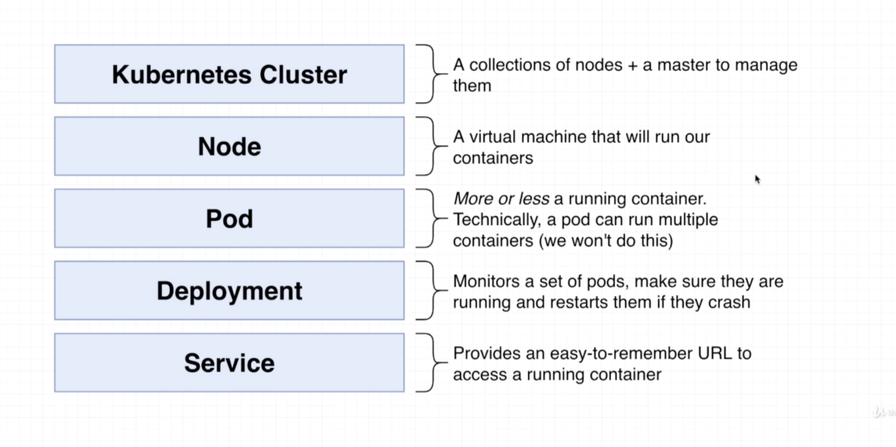
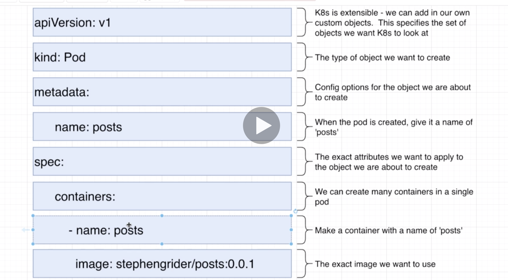
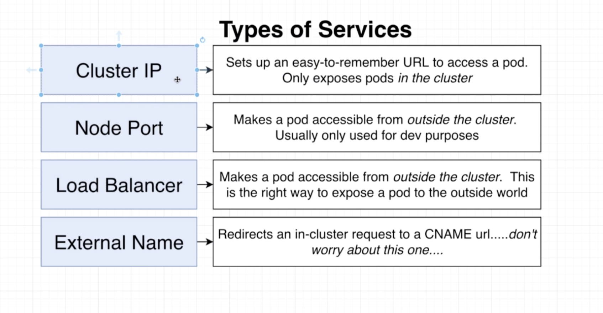
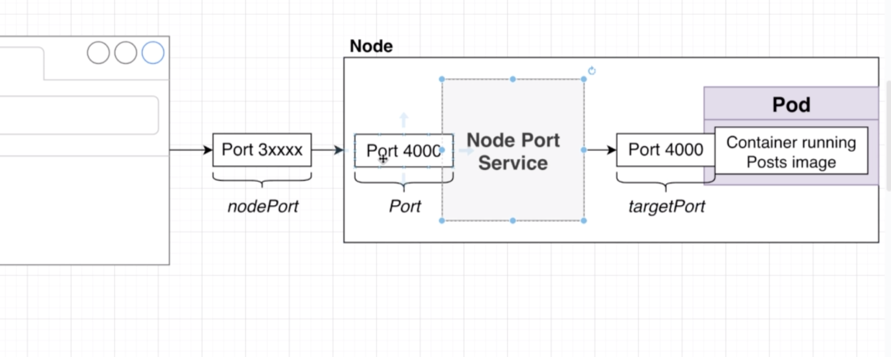

## `KUBERNETES`

#### Key terms:

- there are 4 main "Objects" in the Kube world - the pod, container, [service](#kube-service-config) and [deployment](#deployment-config). Every Kube cluster has one or more nodes, and each node has these objects in it.
- **all** objects in the kube world are necessarily defined using a config file.  
  

#### Basics of config files




##### Pod Config

```yaml
apiVersion: v1
kind: Pod # create a pod
metadata:
  name: posts # with name posts
spec:
  containers:
    - name: posts # has exactly one container in it, named posts
      image: zeuslawyer/posts:0.0.1  // build using this image, with specific version. "latest" retrieves from docker hub by default
```

#### Kube Commands

- To run a Kube Object (deployment, pod, service etc)In terminal, navigate to where the `.YAML` file is and then type in `kubectl apply -f posts.yaml`

- to **list** the kube objects run `kubectl get <object type>`

- to **stop** a given pod or deployment run `kubectl delete <object type> <id>`

- to look at `console.log`s from files, get the pod id (`kubectl get pods`) and then run `kubectl logs <podId>`

- Any time you make a change to the underlying files and need to **update** / restart the Kubernetes Pod (`Deployment`) you run `kubectl rollout restart deployment<depl name>`. But the docker image needs to be updated first and pushed to docker hub. See below:


- update the underlying docker image for a Deployment. To push to docker hub use `docker push zeuslawyer/<docker-image name>`.


##### Deployment Config

The `Deployment` is a Kube object type that manages pods and connectivity between pods.

```yaml
apiVersion: apps/v1
kind: Deployment
metadata:
  name: posts-depl # name of deployment
spec:
  replicas: 1 # number of pods to spawn
  selector: # select which pods this Deployment is in charge of managing
    matchLabels:
      app: posts
  template: # specify which pods to work with
    metadata:
      labels:
        app: posts
    spec:
      containers: # list of containers to create within the pod, with their config
        - name: posts
          image: zeuslawyer/posts:latest
```

##### Kube Service Config

The `Service` is a Kube object type that manages networking and comms between pods, clusters (internal and external comms) etc.





##### sample config file `posts-serv.yaml`

```yaml
apiVersion: v1
kind: Service # type of Kube object
metadata:
  name: post-srv # name of this Kube Service
spec:
  type: NodePort # type of Kube Service being configured
  selector:
    app: post-srv # name of the container to  expose via NodePort service
  ports: # array of ports to expose
    - name: posts
      protocol: TCP
      port: 5001 # port to open to income requests
      targetPort: 5001 # maps to the port on which the Post server is listening
```

- run `kubectl get services` to see the services objects
- run the service by calling `kubectl apply -f posts-srv.yaml` from inside the `binfra/k8s` directory
- run `k describe service <service name>` to get metadata about a given service

##### Kubernetest Env Variable configuration through the Secrets object

Kubernetes has an object type called Secret that stores secrets securely and makes them available to other pods/containers in the cluster , as env vars.

- create a "generic" JWT secret with `kubectl create secret generic <<name of secret>> --from-literal=<KEY_NAME>=<KEY VALUE>`.
- list available secrets by doing `kubectl get secrets`
- update the config `-depl.yaml` file for each pod/container that needs to read the env var :

  ```yaml
  template: # the pod config starts here
  metadata:
    labels:
      app: auth # name of the container this deployment relates to
  spec:
    containers: # array of containers inside a pod
      - name: auth
        image: zeuslawyer/project3-auth # us.gcr.io/eastern-team-278907/auth
        env: # environment variables loaded from the kube secrets object
          - name: JWT_KEY # name of the env variable. generally best to give it the same name as the key of the relevant env var
            valueFrom:
              secretKeyRef:
                name: auth-jwt # name of the Kube secret object (not the key or env var)
                key: JWT_KEY # KEY_NAME from the CLI command that creates the secret
  ```
