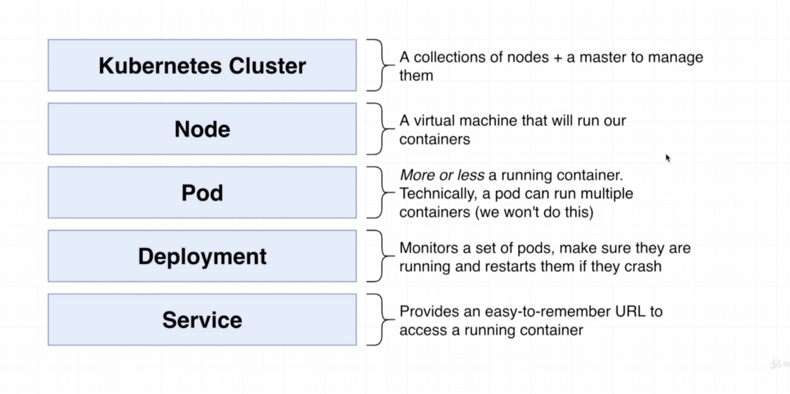
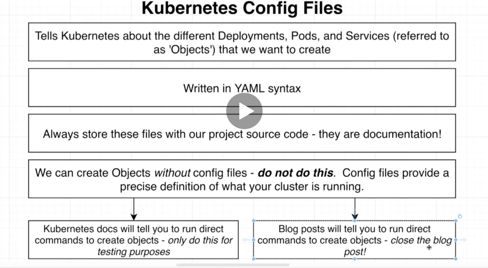
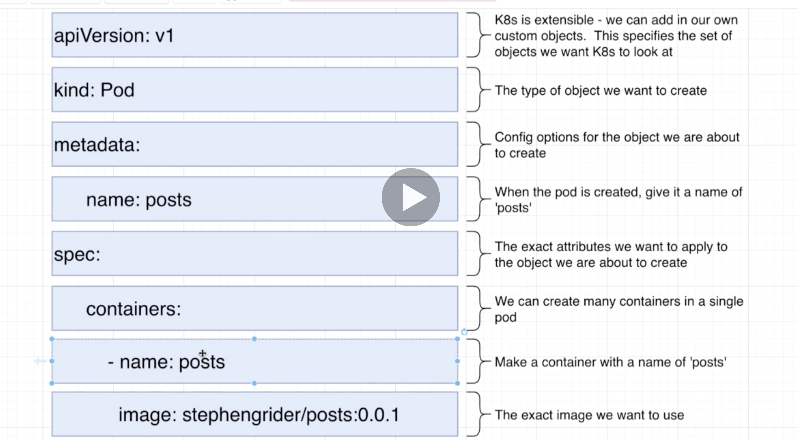
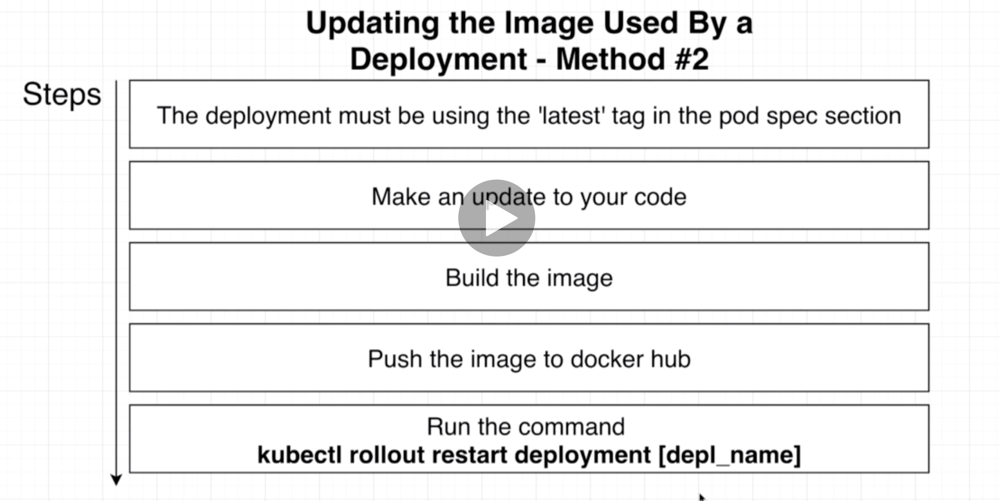
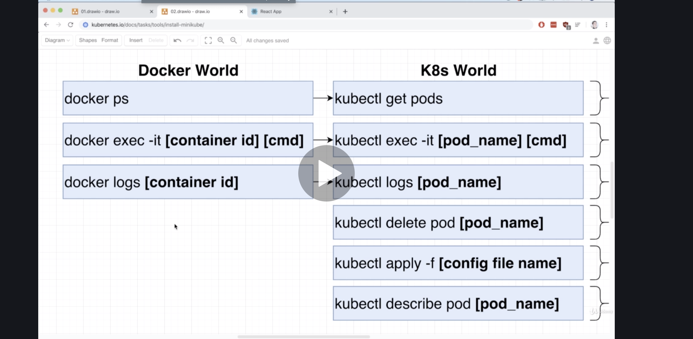
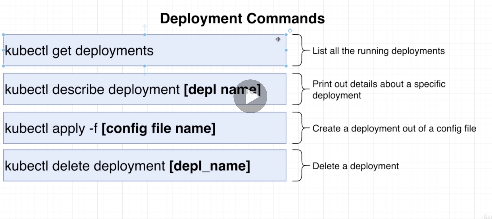
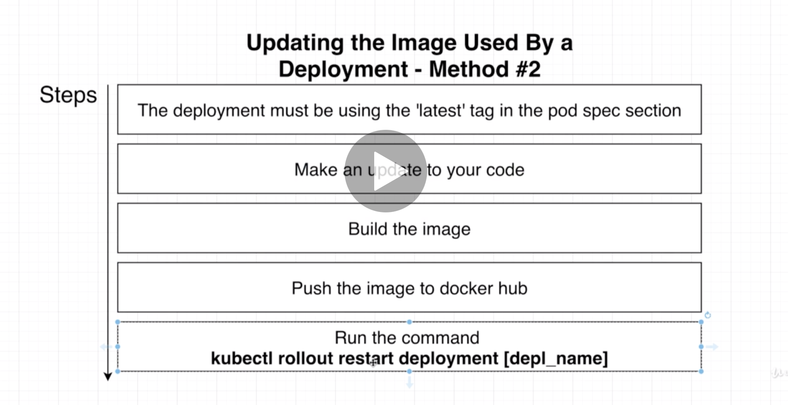
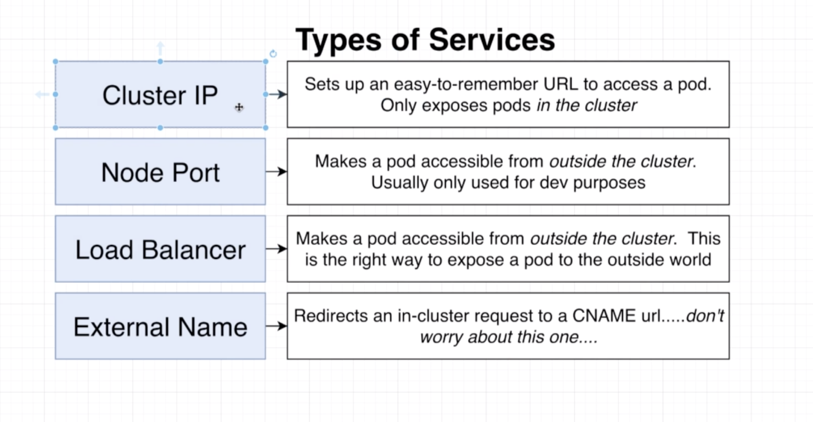
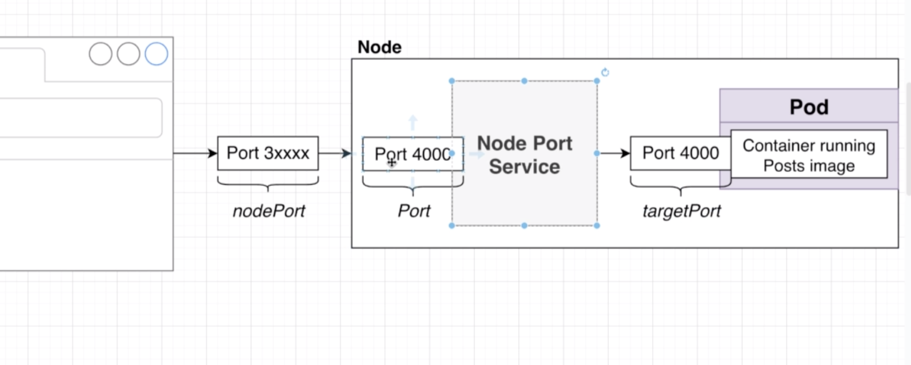

# `MICROSERVICES`

A course designed to understand:

- the challenges of data exchange in microservices
- best practices with sync and async patterns to communicate between microservices
- implement an Event Bus, and then used common industry tooling to handle communications

## `FOLDER STRUCTURE`

Each project represents a discrete chunk of code, and stages in the learning journey.

Each stage of the course is also reflected in a branch, whose name should correlate with the folder associated with each stage in the course.

#### `Project 1`

This is a made-from-scratch react front end, with multiple backend services (separated out to mimic microservices). The app is meant to simulate a blog/NewsFeed type scenario with Posts and Comments. It is **extremely** basic and crude, and only intended to illustrate the challenges in true production-grade challenges presented by microservices.

- the `React` front end app is on port `3000`
- the `Posts` service is on port `5001`. It receives posts and it emits events into the event bus. It also receives events from the event bus.
- the `Comments` service is on port `5002`. It receives comments and emits `CommentCreated` events into the event bus. It also receives events from the event bus. Comments are sent to the `Moderator` service, which moderates it and emits it back with `status` to `CommentModerated`. Then the `Comments` service updates its database, and emits with `CommentUpdated` through the event bus, to be picked up by the `Query` Service.
- the `Query` service is on port `5004`. It fetches data for the Front End. It joins `Posts` and `Comments` and returns them. It receives events from the event bus.
- the `Comment Moderator` service is on port `5003`. It receives events from the event bus. It moderates the `status` flag on `Comments` and emits an event that notifies subscribers that comments have been updated. The `Query` service listens for this update to update the presentation layer with updated comment data.
- the `Event Bus` service is on port `5005`. Event objects havfe two properties : `type` and `data`. The event data also publishes events to the other 3 services.

All services that recieve post requests emit events into the Event Bus. The event bus then emits it out to all subscribing services.
The `Query` service protects against failures of the `Posts` and `Comments` service by receiving all relevant events, and persisting in its own database.

The Front End queries all posts and attached comments from the `Query` service, rather than directly from the `Post` and `Comments` service; however, the actual posting of new comments goes into those services directly. **Thus reads and writes are handled by different services**.

## `DOCKER`

This section pertains to the folder `docker-redis`.

#### `Container and Image management`

- **list** all containers `docker container ls -a` or `docker ps --all`f. List all _running_ containers: `docker ps`
- **stop** running a single container with `docker stop <container id>` and stop running multiple containers with `docker container stop 75835a67d134 2a4cca5ac898` command followed by a list of all containers IDs. `docker container stop $(docker container ls -aq)` will stop _all_ running containers. **kill** with `docker container kill`. `stop` sends a `SIGTERM` and gives process time to wrap up. `kill` sends a `SIGKILL`.
- **remove** one or more containers by id with `docker container rm b4fade9f1784 <id2>`. Remove all stopped containers, all dangling images, and all unused networks `docker system prune`, and this is important to free up space taken up by stopped containers.
- **list** all images `docker images` or `docker image ls`
- **remove** images by reference to their ID `docker image rm 75835a67d134 2a4cca5ac898`

#### `running Docker containers (docker run)`

Note: `docker run` = `docker create` + `docker start`, from a given image.

- to run a locally available image (or download an image from Docker Hub and then run it locally) use `docker run <image name> < [override command] >`. The optional override command overrides the default command for the container.
- to see the output of a container (without re-starting it) run `docker logs <container id>`. This is useful for inspecting, debuging and reviewing whats going on in containers.
- to map system ports into ports inside the container (needed for incoming requests only), use `docker run -it -p [local host port] : [port in container] <image id>`. The `-it` helps with terminal access [see this section](#container-terminal-shell-access) into the container, so that a `ctrl+c` stops the server.

#### `Dockerfile - building docker images (docker build)`

An image requires that a `Dockerfile` first be generated, and that defines the basic config/setup needed for our containerized app. Each step inside a Dockerfile is cached, and so changes trigger a re-run of _all_ steps that come on and after the changed one, but not preceding steps.

- from inside the folder which has the `Dockerfile` image, run `docker build .` After building the terminal will show `Succesfully built <<some image id>>`. Copy that id and do `docker run <<image id>>`.
- to build with a name (aka tag) for the image, run `docker build -t zeuslawyer/<< project-name >>:latest .` With that we can generate the container with `docker run zeuslawyer/<< project-name >> .`. Don't forget the `.` at the end!
- the `Dockerfile` will have some basics commands like `FROM`, `RUN` and `CMD`. `FROM` indicates which docker "base image" . and version to use - e.g. `FROM node:10.20.1-jessie-slim` . `RUN` issues the command we want to run while creating the docker image. `CMD` specifies what should be executed when the image is used to spawn a container - e.g. `CMD ["npm", "start"]`.
- to use an existing container, modify its filesystem and contents, and then generate an image out of that (usually its image -> container, but this is container -> modify -> image) we run the following: `docker commit -c 'CMD["<< override command that usually goes into Dockerfile >>"]' << container id >>`. So that is something like `docker commit -c 'CMD["redis-server"]' f70734b6a266`. That generates a new image, which you can then run with `docker run <...>`.
- set the working directory inside the container relateive to its current position by adding `WORKDIR /usr/app`. This directory will be visible when you do a `ls` from inside a container's shell ([shell access](#container-terminal-shell-access)). When you access the container via the shell it will go directly to the WORKDIR.
- when creating the docker file you may need to specify that certain files from the local filesystem need to be copied over to the image. For that use `COPY <source path - relative to Dockerfile> <WORKDIRr>`. This is often broken into two steps - first copying the `package.json` and then copying the main code. This is so that changes to the code dont trigger a rebuild and reinstall of all the dependencies, as the cache tracks what has changed. so two separate copy commands separates the cache and it only rebuilds stuff that is changed. This often looks like

  ```Dockerfile
  COPY ./package.json ./
  RUN yarn install

  COPY ./ ./
  ```

- ignore files and filders from copy with a `.dockerignore` file.

#### `container terminal shell access`

- execute another command that is provided as input into the container `docker exec -it <<container id>> << command >>`. This attaches another process to a container _that is already running_. Useful for adding shell access to it.
- **but** its better to open up a shell tunnel into the container's process. For that use `docker exec -it <<container id>> sh`. That will give us a `#` sign as a shell prompt
- you can also startup a container from an image, and immediate tunnel into a shell process within it _without_ interacting with the underlying program. Do this with `docker run -it <<image name>> sh`. The `sh` at the end is what produces the command prompt inside.
- exit shell with `ctrl d` or `exit`

## `KUBERNETES`

#### Key terms:

- there are 4 main "Objects" in the Kube world - the pod, container, [service](#kube-service-config) and [deployment](#deployment-config). Every Kube cluster has one or more nodes, and each node has these objects in it.
- **all** objects in the kube world are necessarily defined using a config file.  
  

#### Basics of config files




##### Pod Config

```yaml
apiVersion: v1
kind: Pod # create a pod
metadata:
  name: posts # with name posts
spec:
  containers:
    - name: posts # has exactly one container in it, named posts
      image: zeuslawyer/posts:0.0.1  // build using this image, with specific version. "latest" retrieves from docker hub by default
```

#### Kube Commands

- To run a Kube Object (deployment, pod, service etc)In terminal, navigate to where the `.YAML` file is and then type in `kubectl apply -f posts.yaml`

- to **list** the kube objects run `kubectl get <object type>`

- to **stop** a given pod or deployment run `kubectl delete <object type> <id>`

- to look at `console.log`s from files, get the pod id (`kubectl get pods`) and then run `kubectl logs <podId>`

- Any time you make a change to the underlying files and need to **update** the `Deployment` you run `kubectl rollout restart deployment<depl name>`. But the docker image needs to be updated first and pushed to docker hub. See below:







- update the underlying docker image for a Deployment. To push to docker hub use `docker push zeuslawyer/<docker-image name>`.



##### Deployment Config

The `Deployment` is a Kube object type that manages pods and connectivity between pods.

```yaml
apiVersion: apps/v1
kind: Deployment
metadata:
  name: posts-depl # name of deployment
spec:
  replicas: 1 # number of pods to spawn
  selector: # select which pods this Deployment is in charge of managing
    matchLabels:
      app: posts
  template: # specify which pods to work with
    metadata:
      labels:
        app: posts
    spec:
      containers: # list of containers to create within the pod, with their config
        - name: posts
          image: zeuslawyer/posts:latest
```

##### Kube Service Config

The `Service` is a Kube object type that manages networking and comms between pods, clusters (internal and external comms) etc.





##### sample config file `posts-serv.yaml`

```yaml
apiVersion: v1
kind: Service # type of Kube object
metadata:
  name: post-srv # name of this Kube Service
spec:
  type: NodePort # type of Kube Service being configured
  selector:
    app: post-srv # name of the container to  expose via NodePort service
  ports: # array of ports to expose
    - name: posts
      protocol: TCP
      port: 5001 # port to open to income requests
      targetPort: 5001 # maps to the port on which the Post server is listening
```

- run `kubectl get services` to see the services objects
- run the service by calling `kubectl apply -f posts-srv.yaml` from inside the `infra/k8s` directory
- run `k describe service <service name>` to get metadata about a given service
