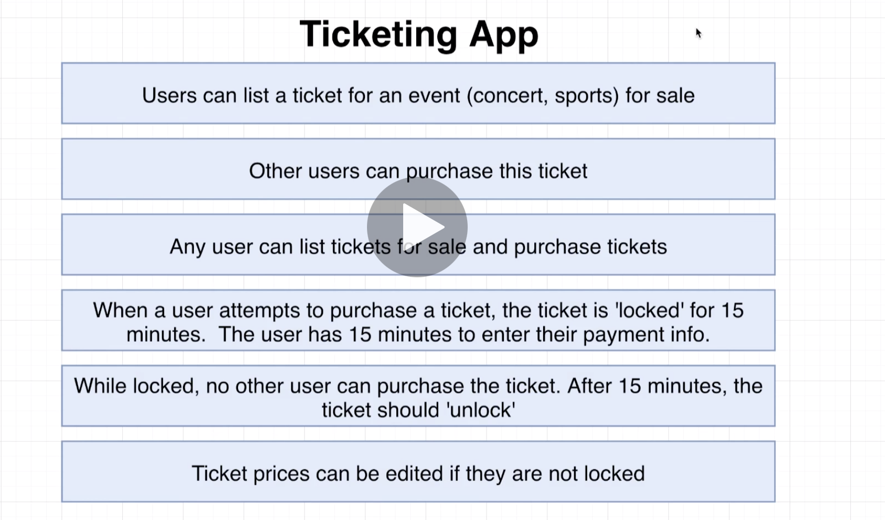
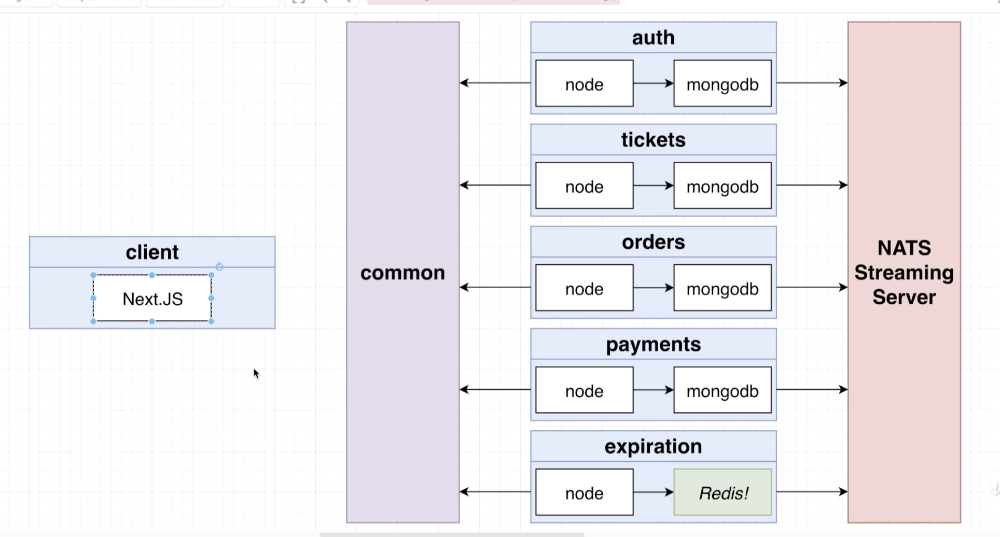
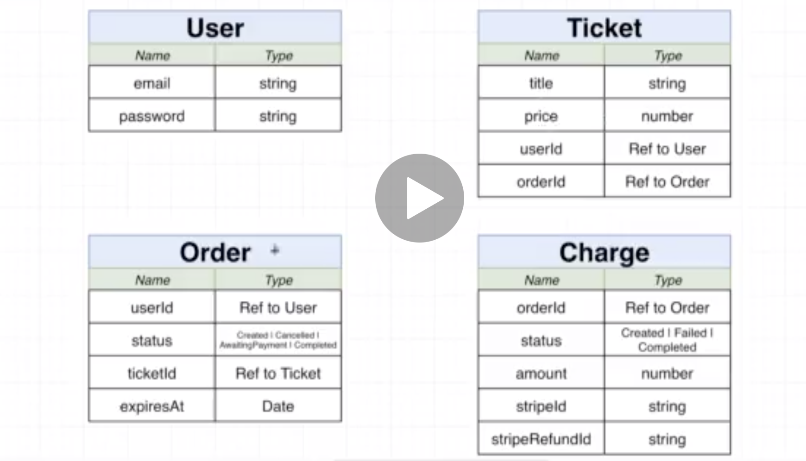
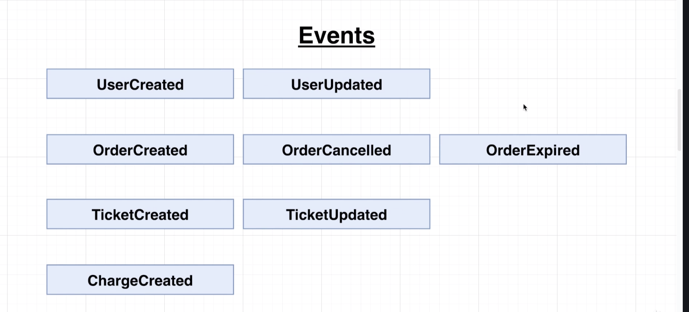
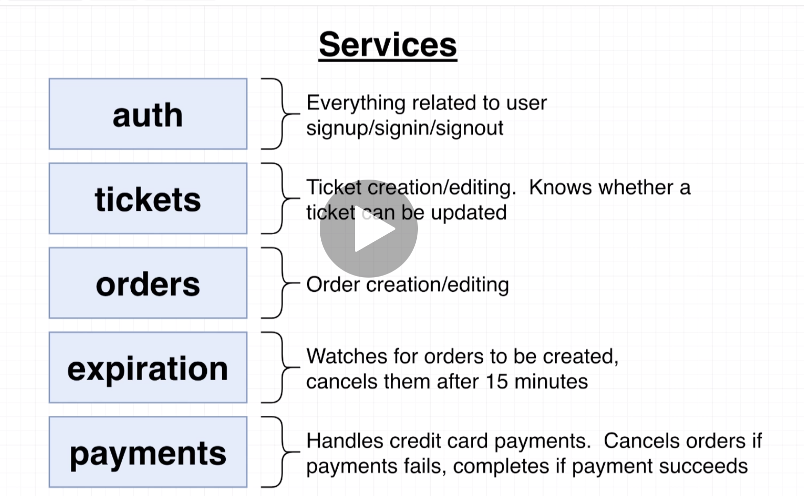

# `MICROSERVICES`

A course designed to understand:

- the challenges of data exchange in microservices
- best practices with sync and async patterns to communicate between microservices
- implement an Event Bus, and then used common industry tooling to handle communications

## `TECHNOLOGY STACK`

- JavaScript & TypeScript
- Docker, Kubernetes, Skaffold
- ReactJs / NextJs (server-side rendering)
- NodeJs, Express, MongoDb
- Redis
- Google Cloud Platform - Kubernetes
- custom NPM module/library called `common`
- NATS streaming event-bus

## `FOLDER STRUCTURE`

Each project represents a discrete chunk of code, and stages in the learning journey.

Each stage of the course is also reflected in a branch, whose name should correlate with the folder associated with each stage in the course.

#### `Project 1`

This is a made-from-scratch react front end, with multiple backend services (separated out to mimic microservices). The app is meant to simulate a blog/NewsFeed type scenario with Posts and Comments. It is **extremely** basic and crude, and only intended to illustrate the challenges in true production-grade challenges presented by microservices.

- the `React` front end app is on port `3000`
- the `Posts` service is on port `5001`. It receives posts and it emits events into the event bus. It also receives events from the event bus.
- the `Comments` service is on port `5002`. It receives comments and emits `CommentCreated` events into the event bus. It also receives events from the event bus. Comments are sent to the `Moderator` service, which moderates it and emits it back with `status` to `CommentModerated`. Then the `Comments` service updates its database, and emits with `CommentUpdated` through the event bus, to be picked up by the `Query` Service.
- the `Query` service is on port `5004`. It fetches data for the Front End. It joins `Posts` and `Comments` and returns them. It receives events from the event bus.
- the `Comment Moderator` service is on port `5003`. It receives events from the event bus. It moderates the `status` flag on `Comments` and emits an event that notifies subscribers that comments have been updated. The `Query` service listens for this update to update the presentation layer with updated comment data.
- the `Event Bus` service is on port `5005`. Event objects havfe two properties : `type` and `data`. The event data also publishes events to the other 3 services.

All services that recieve post requests emit events into the Event Bus. The event bus then emits it out to all subscribing services.
The `Query` service protects against failures of the `Posts` and `Comments` service by receiving all relevant events, and persisting in its own database.

The Front End queries all posts and attached comments from the `Query` service, rather than directly from the `Post` and `Comments` service; however, the actual posting of new comments goes into those services directly. **Thus reads and writes are handled by different services**.

#### `Project 2`

Containerizes `Project 1`. Adds kubernetes and ends with adding Skaffold as a dev tool.

#### `Project 3`

Build a [stubhub.com](stubhub.com) clone using microservices and event-driven architecture

##### `App Overview`

##### `App Design`

##### `App Objects(Resources)`

##### `App Events`

##### `App Services`

